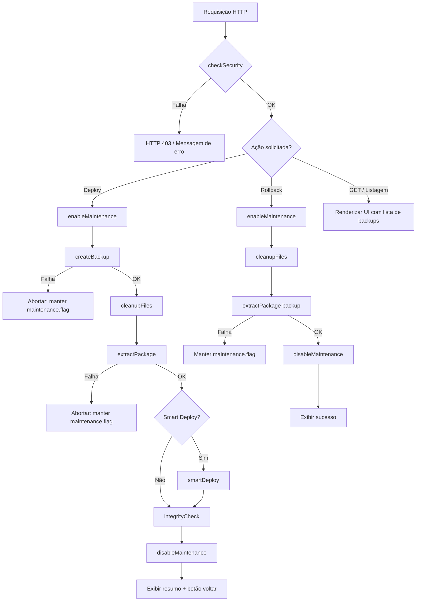

# Design Document — Sistema de Deploy Automatizado

## Overview

O `deploy.php` é um arquivo PHP único, plug-and-play, que implementa um pipeline completo de deploy para a plataforma OursMusic rodando em XAMPP/Windows VPS. Ele é acessado via browser pelo administrador, executa todas as etapas de forma sequencial (segurança → manutenção → backup → limpeza → extração → verificação → conclusão) e exibe feedback em tempo real via `Log_Panel`.

A arquitetura é intencionalmente monolítica (single-file) para facilitar distribuição e instalação — sem dependências externas, sem composer, sem npm. Toda a lógica reside em funções PHP puras usando apenas extensões nativas (`ZipArchive`, `RecursiveIteratorIterator`, `RecursiveDirectoryIterator`).

**Caminhos do ambiente de produção:**
- `ROOT_PATH`: `C:/xampp/htdocs/oursmusics/` — frontend React (arquivos estáticos)
- `BACKEND_PATH`: `C:/backend-server/` — NestJS compilado
- `BACKUP_PATH`: `C:/xampp/htdocs/oursmusics/backup_deploy/`
- `deploy.php` reside em: `C:/xampp/htdocs/oursmusics/admin/deploy.php`

---

## Architecture

O sistema segue um pipeline linear com pontos de aborto em caso de falha crítica. Cada etapa registra seu progresso no `Log_Panel` antes de prosseguir.



**Fluxo de renderização:**
- Requisições `GET` renderizam a interface HTML completa (formulário + lista de backups)
- Requisições `POST` executam o pipeline e fazem output de HTML incremental (log em tempo real via `flush()` + `ob_flush()`)

---

## Components and Interfaces

### Constantes de Configuração

```php
define('ROOT_PATH',        'C:/xampp/htdocs/oursmusics/');
define('BACKEND_PATH',     'C:/backend-server/');
define('BACKUP_PATH',      ROOT_PATH . 'backup_deploy/');
define('MAX_UPLOAD_SIZE',  524288000); // 500MB
define('ALLOWED_IPS',      ['127.0.0.1', '::1']); // configurar com IPs reais
```

### Funções Principais

| Função | Responsabilidade | Retorno |
|---|---|---|
| `checkSecurity()` | Valida sessão admin + IP + sanitiza inputs | `void` (termina execução em falha) |
| `enableMaintenance()` | Cria `maintenance.flag` | `bool` |
| `disableMaintenance()` | Remove `maintenance.flag` | `bool` |
| `createBackup(string $tag)` | Comprime ROOT_PATH em ZIP datado | `string\|false` (caminho do backup) |
| `cleanupFiles(array $preserve)` | Remove arquivos exceto lista de preservação | `array` (log de operações) |
| `extractPackage(string $zipPath, string $dest)` | Extrai ZIP com proteção de path traversal | `array` (arquivos extraídos) |
| `smartDeploy(string $zipPath)` | Roteia `/backend/` e `/frontend/` do ZIP | `bool` |
| `integrityCheck(array $files, string $dest)` | Verifica existência dos arquivos extraídos | `array` (arquivos ausentes) |
| `rollback(string $backupFile)` | Executa pipeline de restauração | `bool` |
| `logMessage(string $msg, string $type)` | Emite linha no Log_Panel com flush | `void` |
| `listBackups()` | Retorna backups ordenados por data desc | `array` |
| `renderUI()` | Renderiza interface HTML completa | `void` |

### Interface HTTP

```
GET  /admin/deploy.php          → renderUI() — formulário + lista de backups
POST /admin/deploy.php          → pipeline de deploy (action=deploy)
POST /admin/deploy.php?rollback → pipeline de rollback (action=rollback&backup=arquivo.zip)
```

### Integração com Sessão PHP

O sistema integra-se à sessão PHP existente da plataforma. Espera que `$_SESSION['user']['is_admin'] === true` (ou equivalente configurável) esteja definido pelo sistema de autenticação do backend NestJS via cookie de sessão PHP.

---

## Data Models

### Estrutura do Arquivo ZIP de Deploy

```
deploy-package.zip
├── frontend/          ← (Smart Deploy) copiado para ROOT_PATH
│   ├── index.html
│   ├── assets/
│   └── ...
├── backend/           ← (Smart Deploy) copiado para BACKEND_PATH
│   ├── dist/
│   ├── package.json
│   └── ...
└── (arquivos na raiz) ← deploy direto para ROOT_PATH
```

### Metadados do Backup (`version.json`)

```json
{
  "timestamp": "2025-01-15T14:30:00Z",
  "backup_file": "backup_2025-01-15_14-30-00.zip",
  "version_tag": "v2.1.0",
  "deployed_by": "admin"
}
```

### Arquivo de Versão (`deploy_version.txt`)

```
v2.1.0
```

### Estrutura do Log_Panel (HTML gerado)

Cada chamada a `logMessage()` emite:

```html
<div class="log-line log-{type}">
  <span class="log-time">14:30:05</span>
  <span class="log-msg">✅ Backup criado: backup_2025-01-15_14-30-00.zip</span>
</div>
```

Tipos: `success` (verde), `error` (vermelho), `warning` (amarelo), `info` (cinza).

### Estado do Maintenance Mode

```
ROOT_PATH/maintenance.flag  ← arquivo vazio; presença = modo ativo
```

O `.htaccess` da plataforma deve verificar este arquivo para redirecionar usuários para página de manutenção:

```apache
RewriteCond %{DOCUMENT_ROOT}/maintenance.flag -f
RewriteCond %{REQUEST_URI} !^/maintenance\.html
RewriteCond %{REQUEST_URI} !^/admin/
RewriteRule ^ /maintenance.html [R=302,L]
```

---

## Correctness Properties

*A property is a characteristic or behavior that should hold true across all valid executions of a system — essentially, a formal statement about what the system should do. Properties serve as the bridge between human-readable specifications and machine-verifiable correctness guarantees.*

### Property 1: Rejeição de IPs não autorizados

*Para qualquer* requisição cujo IP de origem não esteja na lista `ALLOWED_IPS`, o sistema deve retornar HTTP 403 e não executar nenhuma operação de deploy, backup ou modificação de arquivos.

**Validates: Requirements 1.2, 1.4**

---

### Property 2: Rejeição de arquivos não-ZIP

*Para qualquer* arquivo enviado cuja extensão não seja `.zip` ou cujo MIME type real não seja `application/zip` / `application/x-zip-compressed`, o sistema deve rejeitar o upload sem modificar nenhum arquivo no servidor.

**Validates: Requirements 2.1, 2.2, 2.4, 2.5**

---

### Property 3: Proteção contra directory traversal

*Para qualquer* arquivo ZIP contendo entradas com caminhos que tentem escapar do diretório de destino (ex: `../../etc/passwd`), o sistema deve abortar a extração e nenhum arquivo deve ser escrito fora do `ROOT_PATH` ou `BACKEND_PATH`.

**Validates: Requirements 2.7, 2.8**

---

### Property 4: Maintenance flag é a primeira e última operação

*Para qualquer* execução de deploy, o arquivo `maintenance.flag` deve ser criado antes de qualquer modificação de arquivo e só deve ser removido após a conclusão bem-sucedida de todas as etapas. Em caso de falha, o flag deve permanecer ativo.

**Validates: Requirements 3.1, 3.3, 3.4**

---

### Property 5: Backup preserva estado completo

*Para qualquer* estado da plataforma antes do deploy, o backup criado deve conter todos os arquivos de `ROOT_PATH` exceto o próprio diretório `BACKUP_PATH`, e deve ser possível restaurar o estado original via rollback.

**Validates: Requirements 4.1, 4.2, 8.3**

---

### Property 6: Limpeza preserva itens protegidos

*Para qualquer* execução de limpeza com um conjunto de itens marcados para preservação, nenhum item da lista de preservação deve ser removido, e todos os demais devem ser removidos.

**Validates: Requirements 5.1, 5.2, 5.3, 5.4**

---

### Property 7: Smart Deploy roteia corretamente

*Para qualquer* ZIP contendo subdiretórios `/backend/` e/ou `/frontend/`, com Smart Deploy ativado, os arquivos de `/backend/` devem ser copiados exclusivamente para `BACKEND_PATH` e os de `/frontend/` exclusivamente para `ROOT_PATH`.

**Validates: Requirements 6.2, 6.3**

---

### Property 8: Rollback é idempotente ao estado do backup

*Para qualquer* backup válido, executar rollback deve restaurar o sistema ao estado contido no backup, independentemente do estado atual da plataforma.

**Validates: Requirements 8.3, 8.4**

---

## Error Handling

| Situação | Comportamento | Maintenance Flag |
|---|---|---|
| Sessão inválida | HTTP 403, mensagem genérica, encerra execução | Não criado |
| IP não autorizado | HTTP 403, mensagem genérica, encerra execução | Não criado |
| Arquivo não-ZIP / MIME inválido | Mensagem de erro, encerra sem modificar arquivos | Não criado |
| Arquivo > 500MB | Mensagem de erro, encerra sem modificar arquivos | Não criado |
| Directory traversal detectado | Aborta extração, registra erro crítico no log | Mantido ativo |
| Falha ao criar backup | Aborta deploy, exibe erro crítico | Mantido ativo |
| Falha na extração | Aborta deploy, exibe erro crítico | Mantido ativo |
| Falha na limpeza (arquivo individual) | Registra aviso, continua processo | Mantido ativo até conclusão |
| Integrity check com arquivos ausentes | Registra avisos, não aborta | Removido (deploy concluído) |
| Falha no rollback | Mantém manutenção, exibe erro | Mantido ativo |

**Princípio geral:** falhas críticas (backup, extração) abortam o pipeline e mantêm o sistema em manutenção para intervenção manual. Falhas não-críticas (arquivo individual na limpeza, integrity check) são registradas como avisos e o pipeline continua.

Toda exceção PHP deve ser capturada com `try/catch` e registrada via `logMessage()`. O sistema nunca deve exibir stack traces ou mensagens de erro internas do PHP ao usuário.

---

## Testing Strategy

### Abordagem Dual

O sistema usa dois tipos complementares de teste:

- **Testes unitários**: verificam exemplos concretos, casos de borda e condições de erro
- **Testes de propriedade (PBT)**: verificam propriedades universais com entradas geradas aleatoriamente

**Biblioteca PBT recomendada:** [eris](https://github.com/giorgiosironi/eris) (PHP) ou [PHPCheck](https://github.com/nikic/PHPCheck). Para simplicidade no ambiente XAMPP, recomenda-se **eris** via composer dev-dependency, ou implementar um runner mínimo de PBT usando `mt_rand` para geração de entradas.

Cada teste de propriedade deve rodar no mínimo **100 iterações**.

### Testes Unitários

Focados em:
- Exemplos concretos de validação de IP (IP na lista → aceito, IP fora → rejeitado)
- Validação de extensão e MIME type com arquivos reais de fixture
- Criação e remoção do `maintenance.flag`
- Formato do nome do arquivo de backup (`backup_YYYY-MM-DD_HH-mm-ss.zip`)
- Parsing e geração do `version.json`
- Listagem de backups ordenada por data decrescente

### Testes de Propriedade

Cada propriedade do design deve ser implementada por **um único teste de propriedade**. Tag format: `Feature: automated-deploy-system, Property {N}: {texto}`

**Property 1 — Rejeição de IPs:**
```
// Feature: automated-deploy-system, Property 1: IP rejection
// Para qualquer IP gerado aleatoriamente fora de ALLOWED_IPS,
// checkSecurity() deve retornar false/403 sem efeitos colaterais
```

**Property 2 — Rejeição de arquivos não-ZIP:**
```
// Feature: automated-deploy-system, Property 2: Non-ZIP rejection
// Para qualquer extensão/MIME gerado que não seja ZIP válido,
// validateUpload() deve retornar false sem modificar o filesystem
```

**Property 3 — Directory traversal:**
```
// Feature: automated-deploy-system, Property 3: Path traversal protection
// Para qualquer caminho gerado contendo "../", o sistema deve
// rejeitar a entrada e nenhum arquivo deve ser escrito fora do destino
```

**Property 4 — Maintenance flag ordering:**
```
// Feature: automated-deploy-system, Property 4: Maintenance flag lifecycle
// Para qualquer sequência de deploy (sucesso ou falha),
// o flag deve existir durante todas as etapas intermediárias
```

**Property 5 — Backup round-trip:**
```
// Feature: automated-deploy-system, Property 5: Backup completeness
// Para qualquer conjunto de arquivos em ROOT_PATH,
// createBackup() seguido de rollback() deve restaurar o estado original
```

**Property 6 — Limpeza preserva itens protegidos:**
```
// Feature: automated-deploy-system, Property 6: Selective cleanup preservation
// Para qualquer conjunto de arquivos e qualquer lista de preservação,
// cleanupFiles() nunca deve remover itens da lista de preservação
```

**Property 7 — Smart Deploy routing:**
```
// Feature: automated-deploy-system, Property 7: Smart deploy routing
// Para qualquer ZIP com estrutura backend/frontend,
// arquivos de /backend/ devem ir para BACKEND_PATH e /frontend/ para ROOT_PATH
```

**Property 8 — Rollback idempotência:**
```
// Feature: automated-deploy-system, Property 8: Rollback idempotency
// Para qualquer backup válido, rollback aplicado N vezes deve
// produzir o mesmo estado final que aplicado 1 vez
```

### Estrutura de Testes Sugerida

```
tests/
├── unit/
│   ├── SecurityTest.php
│   ├── ValidatorTest.php
│   ├── MaintenanceTest.php
│   ├── BackupTest.php
│   ├── CleanupTest.php
│   └── LogMessageTest.php
└── property/
    ├── IpRejectionPropertyTest.php
    ├── FileValidationPropertyTest.php
    ├── PathTraversalPropertyTest.php
    ├── MaintenanceFlagPropertyTest.php
    ├── BackupRoundTripPropertyTest.php
    ├── CleanupPreservationPropertyTest.php
    ├── SmartDeployRoutingPropertyTest.php
    └── RollbackIdempotencyPropertyTest.php
```
